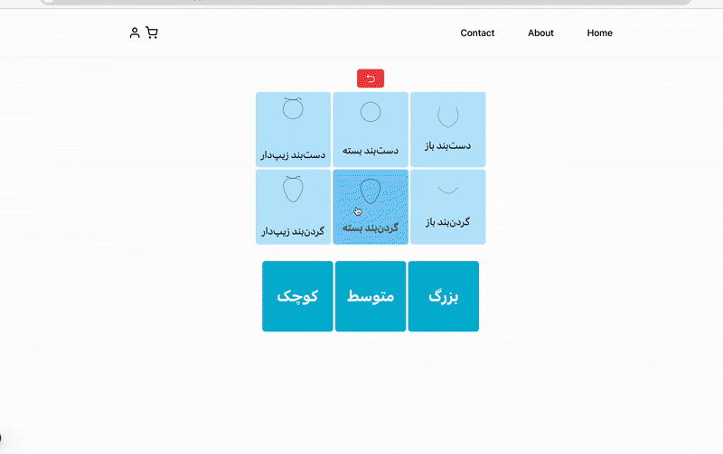
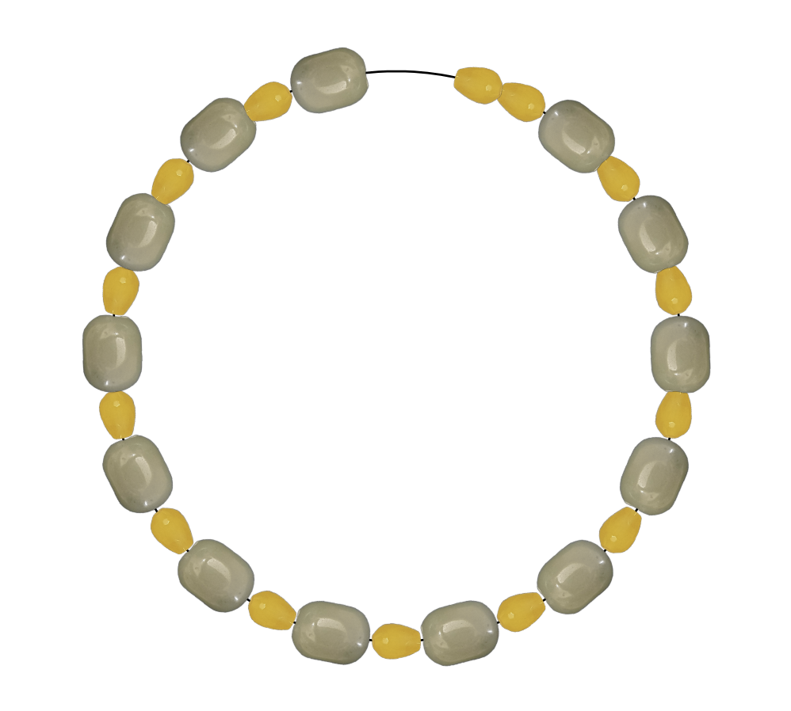
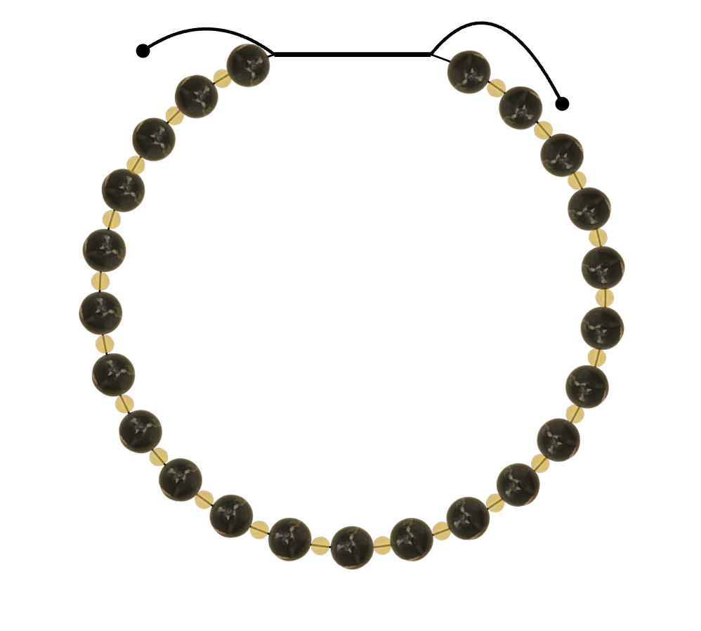
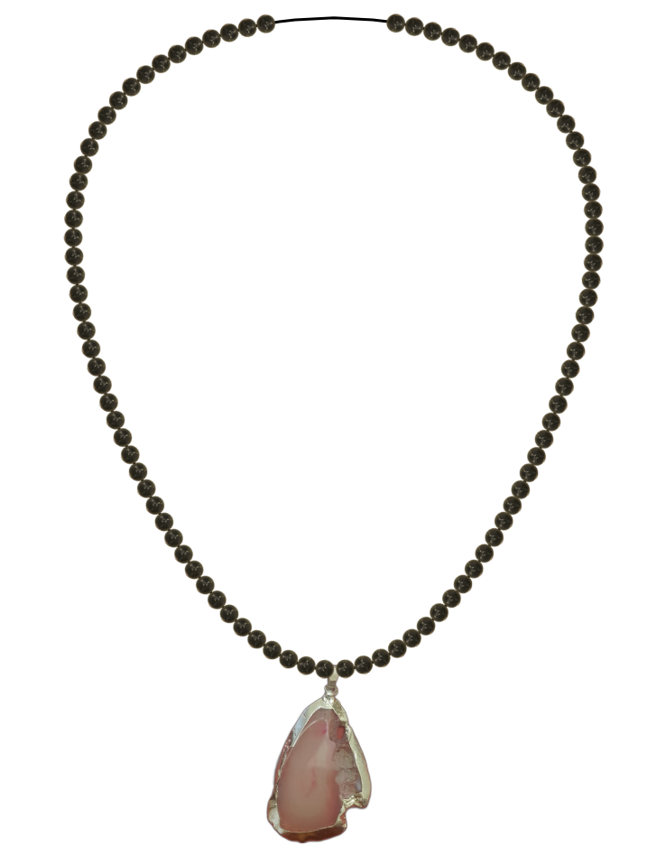
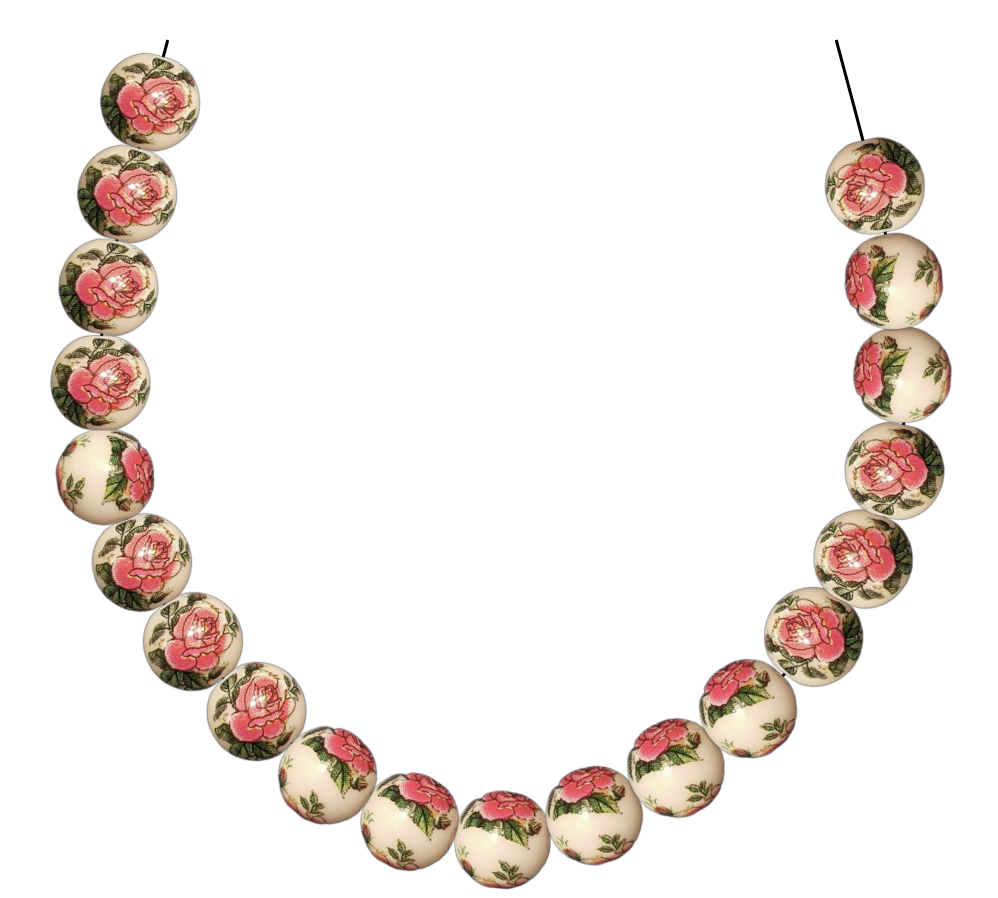

<h1 style="color: black">Mica Market (میکا)</h1>

## Mica: A Next-Generation Interactive Jewelry Marketplace

Mica is an innovative and highly interactive online marketplace for jewelry. Our website is set to launch this month, and we have secured the domain **mica-market.com**.

For the first time, users can design their own bracelets and necklaces with complete freedom and have them delivered to their doorstep.

Beyond the standard features of an online store, Mica introduces an interactive playground and dynamic visual effects (such as the banner on our landing page), setting it apart from all other e-commerce platforms.

 

<h4 style="color: black">My Motivation Behind Mica</h4>

I applied to a university in the USA, but my visa process has been delayed for eight months. During this waiting period, I decided to create an online shop to help my family sell their products. As I worked on this project, I continuously implemented new ideas that came to mind. I also invited my friend, Mr. Maharebi, to collaborate with me on the front-end development.

We have committed to completing this project by the end of this month.

Throughout this journey, I developed a strong interest in WASM and interactive web/XR technologies. This experience has fueled my motivation to pursue a PhD in fields that are directly or indirectly related to these areas. Ultimately, I aspire to work at the intersection of technology and scientific research.

---

<h4 style="color: black">Mica Playground</h4>

Users can choose an accessory type and specify its size (currently, the page content is in Farsi). In the next step, they customize their jewelry by adding, removing, and undoing modifications as needed.

Upon submission, the finalized design is displayed through an interactive animation.

You can see a sample process here:

---

<h4 style="color: black">Mica Application Structure</h4>

- <u>Technology Stack</u>: Node.js / Python microservices with Docker.
- <u>Database & Caching</u>: PostgreSQL as the database and Redis for caching.
- <u>Front-end</u>: React.
- <u>Architecture</u>: Designed with a strong affinity towards WASM.
- <u>Rendering</u>: Partial server-side rendering.
- <u>Libraries</u>: Matter.js is used, with the possibility of integrating Three.js.
- <u>Future Potential</u>: Optimizing WASM for online marketing and providing APIs for other service providers.

---

<h3 style="color: black">Sample Assembles:</h3>

Consider these jeweels and pendant-gem, which are processed and added to the dataset:

 

 
 
 

We can make these bracelets and necklace:

 
 

 
 

 
 

 
 

 

---

