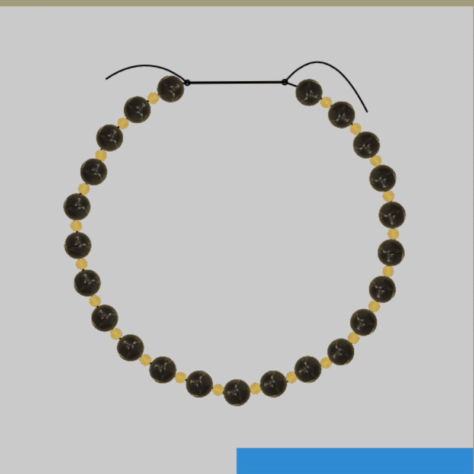

# Mica Market (میکا)

 

Mica is a brand new, highly intractive online market for jewelry. We will lauch the website this month, and domain "mica-market.com" is reserved.

For the first time, users can design their own bracelets and necklaces freely, and receive them at their home.

‌Besides the normal services online shops, Mica provides an interactive playground, and interactive visual effects (e.g. the above banner on the landing page), which makes it different from all other online platforms.

---

## Sample Assembles

Consider these jeweels and pendant-gem, which are processed and added to the dataset:

 

 
 
 

We can make these bracelets and necklace:

 
 

 
 

 
 

 
 

 

---